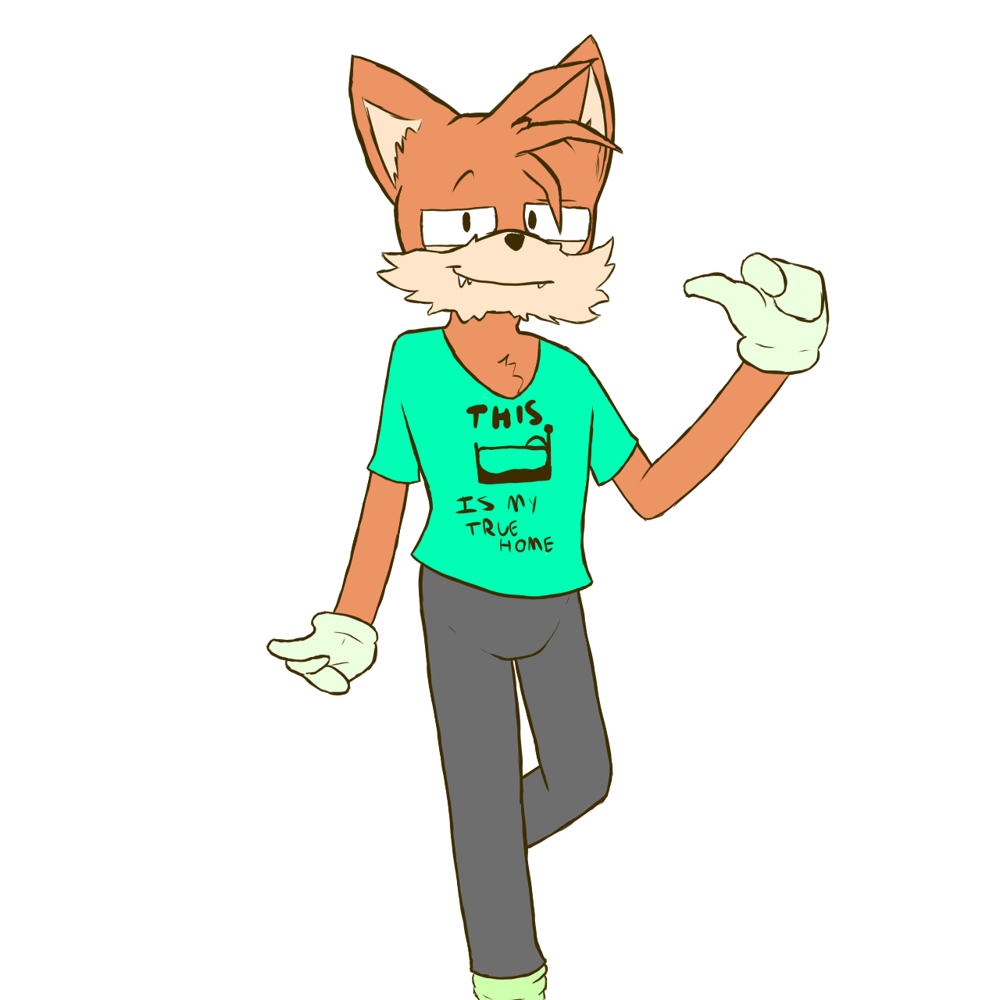

# Art Of The Dizzy AU

Some art, either by MeowcaTheoRange or other people who like the Dizzy AU. Check it out below!

## The First Drawing Of The Dizzy AU, Ever
A simple drawing of Miles "Tails" Prower, but now, with some small twists.

This became the first representation of the Dizzy AU ever existing.

Credit: `MeowcaTheoRange` ([Tumblr](https://meowcatheorange.tumblr.com/))

## Miles (digital)
The first digital drawing of the guy.

Credit: `MeowcaTheoRange` ([Tumblr](https://meowcatheorange.tumblr.com/))

## Miles (human) (digital)
Miles... but human? What the hell?

Credit: `MeowcaTheoRange` ([Tumblr](https://meowcatheorange.tumblr.com/))

## Miles
A reference sheet of Miles. This is currently the latest reference there is of him.

.jpeg)

Credit: `MeowcaTheoRange` ([Tumblr](https://meowcatheorange.tumblr.com/))

## Silver
The first ever drawing of Silver, Miles' ex-manager and current love interest.

*Fun Fact*: Silver's name has been changed from canon. In canon, Silver doesn't *actually* have a last name, the same way `Sonic The Hedgehog` doesn't.

.jpeg)

Credit: `MeowcaTheoRange` ([Tumblr](https://meowcatheorange.tumblr.com/))

## gay homo
theymre gay homo

.jpeg)

Credit: `MeowcaTheoRange` ([Tumblr](https://meowcatheorange.tumblr.com/))

## gay homo v2
theymre gay homo... AGAIN

.jpeg)

Credit: `MeowcaTheoRange` ([Tumblr](https://meowcatheorange.tumblr.com/))

## gay homo vnegative one
theymre gay homo... But negative

.jpeg)

Credit: `MeowcaTheoRange` ([Tumblr](https://meowcatheorange.tumblr.com/))

